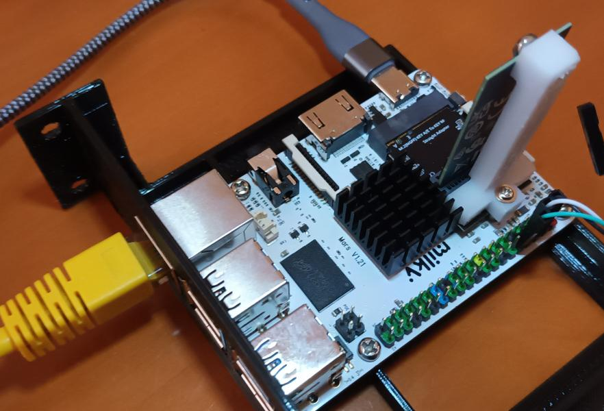

Brackets for NVMe M key to A+E key adapter
==========================================

I am using an m.2 M to m.2 A+E adapter which came only with a bracket for
2280 drives. This repository contains brackets for 2242 and 2230 drives.
An M3 thread cutter is needed for the NVMe screw-hole.

Cf. https://www.aliexpress.com/item/1005006422001136.html

License
-------

Creative Commons Attribution-ShareAlike 4.0 International Public License
(CC BY-SA 4.0)

Details see https://creativecommons.org/licenses/by-sa/4.0/
